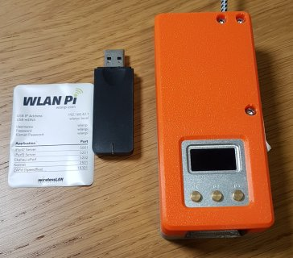
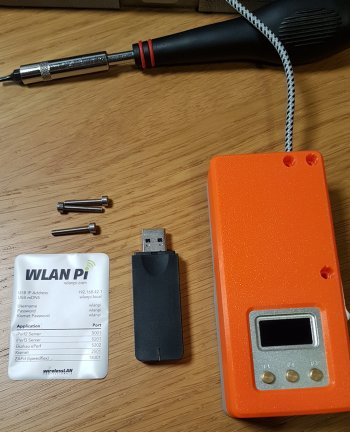

Title: Issues With CF-912AC Frame Capture 
Authors: Nigel Bowden

# Issues With CF-912AC Frame Capture

*8th March 2021 - Author: Nigel Bowden*

The CF-912AC Comfast adapter has long been the "go-to" adapter for use with the WLAN Pi. It is a 2-stream adapter that provides support for PHYs up to 802.11ac.  It uses the Realtek RTL8812AU wireless chipset. It is very versatile when considering the various options it provides for the WLAN Pi, including: acting as an 802.11ac client, supporting monitor mode, packet injection and AP mode. This allows the WLAN Pi to perform a wide variety of actions, such as over the air packet capture and acting as a simple AP.

Since the adoption of the NEO2 platform for the WLAN Pi project, obtaining stable drivers for the CF-912AC has been an ongoing challenge. Thanks to the ongoing efforts of Jerry Olla, the project has managed to source and include drivers of reasonably good quality to provide many of the WLAN Pi Wi-Fi related features.

The WLAN Pi team recently had a report from one of our kind users (thanks [Juan!](https://twitter.com/ibanezjuan_){target=_blank}) that during an over-the-air capture, the WLAN Pi appeared to be only capturing data frames running as basic rates. After further investigation by the WLAN Pi team, it became apparent that data frames that were sent using 2 spatial streams were not being captured. Single stream 802.11ac data frames were captured OK, 802.11n 1 & 2 spatial stream data frames and all legacy rate data frames were captured with no issues. All management and control frames (which all run at legacy rates anyhow) were also fine.

This is suspected to be a driver issue with the Realtek driver, so there is little we can do to fix the 2 stream 11ac capture issue. During testing, it was noted that there may be the occasional 2SS 11ac data frame observed, but this was sporadic and unpredictable. The issue has been [reported by other users](https://github.com/aircrack-ng/rtl8812au/issues/635){target=_blank} of the chipset driver, and we have added our own reports of the observed issue. The issue may be fixed at some stage, but as this issue appears to have bene present for quite some time, this is unlikely to be fixed in the short-term.

## Alternative NIC

Since version 2.x of the WLAN Pi image, support for MediaTek USE wireless adapters has been included. The team has received reports that the driver support for the MediaTek adapters is generally better than the RealTek drivers (for the features that we wish to use). 

Testing by the team over the past few months has indicated that the MediaTek MT7612U drivers seems to perform very well and have no issue with the 2-stream over the air capture. The Mediatek MT7612U adapter option has become a favourite among the developer team.

However, sourcing a USB NIC that contains this chipset has not been without its challenges :)

Internally, the dev team has settled on what is internally referred to as the "no-name" MediaTek adapter. The easiest place to source this adapter is currently the AliExpress store, and is available from many different suppliers - here is once source that I have used: [https://www.aliexpress.com/item/1005001510706842.html](https://www.aliexpress.com/item/1005001510706842.html){target=_blank}. (Hopefully, perhaps some of our suppliers may pick up on thie requirement and make these available). If you search for the phrase `New arrival Black MT7612U` on [Aliexepress](https://www.aliexpress.com){target=_blank}, you will see that there are many suppliers of this USB dongle to choose from. When ordering, you can expect delivery to typically take a few weeks.

## NIC Swap-out 

The good news is that if/when you obtain one of these adapters, if you have the orange-case WLAN Pi kit, it is very easy to swap out the CF-912 NIC inside the case for the no-name MT7612U adapter. Here are a few photos I took when I swapped out my own CF-912 recently. In summary, you will need to:

1. Remove the front panel sticker
2. Use a hex spanner to undo the 3 retaining bolts
3. Remove the micro-SD card
3. Prise the plastic case top/bottom sections apart
4. Take out the Neo2
5. Swap over the CF-912 USB NIC for the MT7612 USB NIC
6. Put the Neo2 back in the case
7. Put the case back together
8. Re-insert the micro-SD card 
9. Re-install the retaining bolts
10. Re-apply the front panel sticker

WLAN Pi case & new MT7612U adapter

WLAN Pi case & new MT7612U adapter

WLAN Pi case & new MT7612U adapter

WLAN Pi case & new MT7612U adapter

WLAN Pi case & new MT7612U adapter

WLAN Pi case & new MT7612U adapter

WLAN Pi case & new MT7612U adapter

[<-- back][back]

<!-- Link list -->
[back]: index.md
